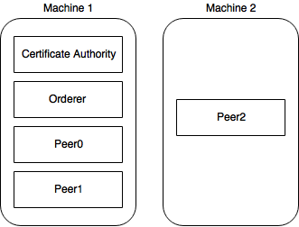
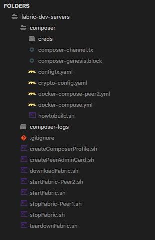
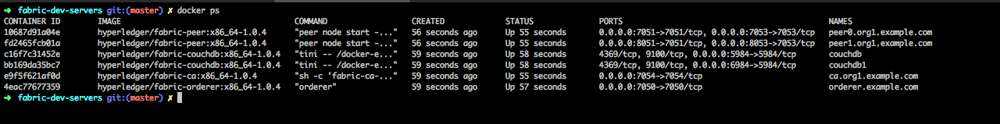
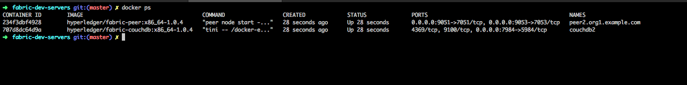

# Hackathon_PoC

## Table of contents
* [The Architecture](#the-architecture)
* [Terms](#terms)
* [Prerequisites](#prerequisites)
* [Setting Up](#settings-up)
* [Configuring Docker Services](#configuring-docker-services)
* [Configuring the scripts](#configuring-the-scripts)

## The Architecture
Hyperledger Fabric has a set of components each with its own roles and functionalities. Each of these will be running on it’s own Docker instances and are configured to work together. These Docker instances even when running on multiple physical machines, can still communicate with each other. That’s essentially the crux of how a blockchain runs on several physical machines.
	
## Terms
### Certificate Authority
The certificate authority is responsible for handling all the access control logic, issuing the identities and permission for the users in the Hyperledger blockchain network.

### Orderer
In order to keep the entire network in a synchronized state, the orderer is used. Whenever a new transaction is to be committed, the orderer is the one informing all the peers about the transaction. A network can have multiple orderers, also it’s advised in order to maintain less faults.

### Peers
Only peers are allowed to commit transactions in the business network. Also each peer has its own copy of the entire world state. It’s connected with CouchDB instances which acts as the database. An organisation can have multiple peers and one or more anchor peer will be used to communicate with other organisations.

In this example, we’ll be having 1 CA, 1 Orderer, and 3 Peers. With 2 Peers running in the first machine, and the other in a second machine.



## Prerequisites
* Install Docker
* Install Composer
* Install Fabric Images (1.0.4)
* Install Fabric Tools

## Setting Up
Since all the components are running inside individual Docker instances, we can easily configure them to run separately.

In this example, I’ll be taking the fabric-dev-server and modify it to run on multiple machines. This is mainly focused towards easier understanding and to use it like a boilerplate.

Here since we’re using only the hlfv1 we’re removing the hlfv11 folder and bringing all the contents of hlfv1 outside.

### The Folder Structure
This is how your codebase should look :



Here if you notice, there are three new files docker-compose-peer2.yml, startFabric-Peer2.sh and stopFabric.sh. As the name implies these are related to the third peer which we will be running on a separate machine.

### Peer Configurations

The default dev server comes with configuration for running one Peer. So, the certificates are created correspondingly. Since we have three peers in total, we need to generate certificates for all the three.

If you’ve installed the fabric tools with the above mentioned script, you’ll have configtxgen and cryptogen in your system. We’ll be using this to generate the certificates for our peers, and CA.

In cypto-config.yaml change the count under PeerOrgs → Template → Count to number of peers you want. In our case it is 3.

Once you made the modifications, run the following inside the composer folder in order to create the certificates for all the peers :

```
$ cd "$(dirname "$0")"
$ cryptogen generate --config=./crypto-config.yaml
$ export FABRIC_CFG_PATH=$PWD
$ configtxgen -profile ComposerOrdererGenesis -outputBlock ./composer-genesis.block
$ configtxgen -profile ComposerChannel -outputCreateChannelTx ./composer-channel.tx -channelID composerchannel
```

This creates all the certificates and the key under crypto-config folder. We will be using this to configure our Docker image’s environment variables.

## Configuring Docker Services
In the docker-compose.yml we have added the following services :

* ca.org1.example.com
* orderer.example.com
* peer0.org1.example.com
* couchdb
* peer1.org1.example.com
* couchdb1

Here the peer0.org1.example.com uses couchdb as the world state database and peer1.org1.example.com uses couchdb1 as world state database.

In order to configure the Certificate Authority, we’ll be using the certificates that have been generated newly. In the command section of ca.org1.example.com make sure to use the proper private key file. It will be located under composer/crypto-config/peerOrganizations/

org1.example.com/ca/ Once you’ve updated it you’re good to go.

## Configuring the scripts
Now we’re ready to run the Fabric network. We’ll be using the fabric-dev-server’s scripts as the base script with a few modifications as mentioned below.

In the startFabric.sh file, by default the configuration for the first peer (peer0.org1.example.com) to join the channel is provided. Now we need to join the second peer (peer1.org1.example.com) to the same channel.

In order to do that we need to fetch the channel block in the second peer and then use that .block file to join the peer.

In the second machine, we’ll be using the same concept of fetching the channel block and joining the channel with the block file.

## Peer Admin Card Creation
Now we need to update the script to create the peer admin card for the network. With the default script createPeerAdminCard.sh we’ll add update the connection profile configuration to add the new peers.

Also you need to update the PRIVATE_KEY path with the corresponding path to the private key of map keystore.

That’s it, everything is set and ready to go. Now lets run the following scripts to start the Hyperledger Fabric network on the first machine.

```
$ ./teardownFabric.sh && ./startFabric.sh && ./createPeerAdminCard.sh
```

```
$ ./startFabric-Peer2.sh
```

If everything is working properly, you’ll notice clean logs and zero errors. Try running docker ps to see all of the services that are running on each of the machines.

In the first machine there are 6 services running.



And in the second machine there are two services running.



When you notice the logs, the peers syncs whenever you create asset of submit transactions. The peer0 will be getting the first transaction submit request and then the orderer distributes to other peers maintaining all the peers in sync.

This readme is a copy of this [link](https://www.skcript.com/svr/setting-up-a-blockchain-business-network-with-hyperledger-fabric-and-composer-running-in-multiple-physical-machine/).

The reference source code : [link](https://github.com/varun-raj/fabric-dev-servers-multipeer).